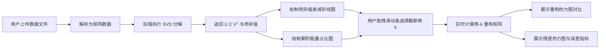

# SVD 谱能量降维分析台 - 产品需求文档

## 1. 产品概述

SVD 谱能量降维分析台是一款纯数学驱动、零 GPU 依赖的浏览器端数据降维可视化工具。用户可上传通用矩阵数据（CSV/Excel 数据表或灰度图片），通过奇异值分解（SVD）直观分析数据的谱特征，动态选择截断秩并实时观察低秩重构效果。

- **核心价值**：让抽象的矩阵降维理论变得可视化、可交互、可感知
- **目标用户**：数据科学学习者、研究者、工程师以及对线性代数感兴趣的人群
- **产品定位**：即查即用的教学演示与数据分析工具

## 2. 核心功能

### 2.1 用户角色
| 角色 | 注册方式 | 核心权限 |
|------|----------|----------|
| 访客用户 | 无需注册 | 上传数据、进行SVD分析、导出结果 |

### 2.2 功能模块
1. **数据上传模块**：支持 CSV / Excel 数据表和灰度图片上传
2. **谱分析图表模块**：奇异值衰减折线图、累积能量占比柱状图
3. **截断秩交互模块**：滑动条动态选择截断秩，实时显示能量占比
4. **重构对比模块**：原始数据与低秩重构数据的并排对比展示
5. **残差分析模块**：残差热力图可视化，量化重构误差

### 2.3 页面详情
| 页面名称 | 模块名称 | 功能描述 |
|----------|----------|----------|
| 主分析台 | 文件上传区 | 拖拽或点击上传 CSV/Excel/图片，显示文件信息与矩阵维度 |
| 主分析台 | 谱能量分析区 | 奇异值衰减折线图（对数刻度）、累积能量占比曲线 |
| 主分析台 | 截断秩控制区 | 滑动条选择截断秩 k，显示当前 k 值与能量保留百分比 |
| 主分析台 | 数据对比区 | 原始矩阵热力图 vs 低秩重构热力图，并排对比 |
| 主分析台 | 残差分析区 | 残差矩阵热力图、Frobenius 范数误差、相对误差指标 |

## 3. 核心流程

**用户操作流程**：
1. 用户进入分析台首页，看到上传区域与示例数据入口
2. 上传 CSV/Excel/图片文件，系统自动解析为二维矩阵
3. 系统自动执行 SVD 分解，展示奇异值衰减曲线和能量占比
4. 用户通过滑动条调整截断秩 k，实时看到重构效果与残差变化
5. 用户可观察不同 k 值下的数据压缩效果与信息损失的权衡

## 4. 用户界面设计

### 4.1 设计风格
- **整体风格**：深色科技风 + 数据可视化专业感，学术与科技融合
- **主色调**：深邃藏青 (#0a1628) 为背景，矩阵蓝 (#3b82f6) 为主色
- **强调色**：光谱渐变色（紫→蓝→青→绿）用于能量可视化
- **字体**：展示字体使用 Space Grotesk，正文字体使用 JetBrains Mono（等宽字体增强数据感）
- **按钮风格**：微圆角、细边框、悬停发光效果
- **布局风格**：卡片式布局，模块分明，信息密度适中
- **视觉细节**：网格背景纹理、微光晕效果、数据流动感动画

### 4.2 页面设计概述
| 页面名称 | 模块名称 | UI 元素 |
|----------|----------|---------|
| 主分析台 | 顶部标题栏 | 产品名称 LOGO、副标题、操作按钮（重置、示例数据） |
| 主分析台 | 上传卡片 | 虚线边框上传区、文件图标、支持格式提示、拖拽效果 |
| 主分析台 | 谱分析卡片 | 双图表布局（奇异值衰减 + 累积能量）、图例、坐标标签 |
| 主分析台 | 滑动控制卡 | 大号滑动条、当前 k 值显示、能量百分比进度环 |
| 主分析台 | 对比视图卡 | 左右分栏（原始/重构）、各自标题、颜色条图例 |
| 主分析台 | 残差分析卡 | 残差热力图、误差指标数值卡、颜色条 |

### 4.3 响应性
- 桌面端（≥1280px）：三栏布局，左侧上传+控制，中间谱图，右侧对比+残差
- 平板端（768-1279px）：两栏布局，上下滚动浏览
- 移动端（<768px）：单列布局，卡片堆叠，优化触摸交互

### 4.4 动效设计
- 页面加载：卡片渐入动画，错落延迟
- 数据上传：文件落地动效 + 解析进度条
- 滑动交互：热力图实时刷新、数值跳动动画
- 悬停效果：卡片微浮起、边框发光、图表数据点高亮
