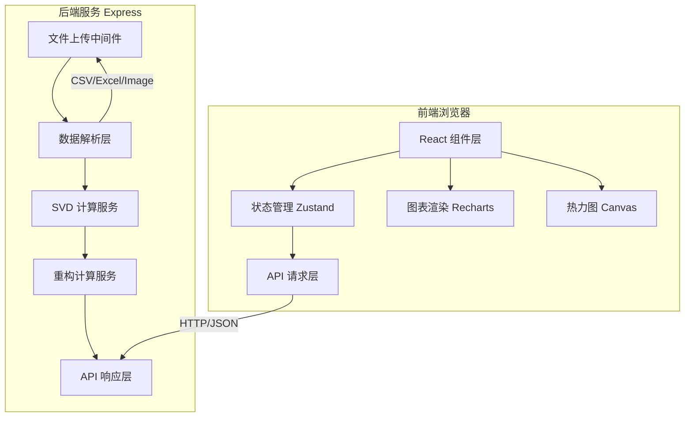

# SVD 谱能量降维分析台 - 技术架构文档

## 1. 架构设计



## 2. 技术描述

- **前端**：React 18 + TypeScript + Vite + TailwindCSS 3 + Zustand + Recharts
- **后端**：Express 4 + TypeScript
- **矩阵计算**：ml-matrix（SVD 分解）+ mathjs（辅助计算）
- **文件解析**：papaparse（CSV）+ xlsx（Excel）+ canvas（图片）
- **初始化工具**：vite-init（react-express-ts 模板）

## 3. 目录结构

```
├── src/                          # 前端源码
│   ├── components/               # 组件
│   │   ├── FileUpload.tsx        # 文件上传组件
│   │   ├── SpectrumChart.tsx     # 奇异值谱图组件
│   │   ├── EnergyChart.tsx       # 能量占比图组件
│   │   ├── RankSlider.tsx        # 截断秩滑动条
│   │   ├── Heatmap.tsx           # 热力图组件
│   │   ├── CompareView.tsx       # 对比视图
│   │   └── ResidualPanel.tsx     # 残差分析面板
│   ├── pages/
│   │   └── Analyzer.tsx          # 主分析台页面
│   ├── hooks/                    # 自定义 hooks
│   │   └── useSvdAnalysis.ts     # SVD 分析逻辑
│   ├── store/                    # Zustand 状态
│   │   └── useAnalysisStore.ts
│   ├── utils/                    # 工具函数
│   │   ├── api.ts                # API 封装
│   │   └── format.ts             # 格式化工具
│   ├── types/                    # 类型定义
│   │   └── index.ts
│   ├── App.tsx
│   └── main.tsx
├── api/                          # 后端源码
│   ├── index.ts                  # Express 入口
│   ├── routes/
│   │   └── svd.ts                # SVD 路由
│   ├── services/
│   │   └── svdService.ts         # SVD 计算服务
│   └── utils/
│       ├── matrixParser.ts       # 矩阵解析工具
│       └── fileHandler.ts        # 文件处理工具
├── shared/                       # 共享类型
│   └── types.ts
├── package.json
├── vite.config.ts
├── tailwind.config.js
└── tsconfig.json
```

## 4. API 定义

### 4.1 SVD 分解接口

**请求**：
```typescript
interface SvdRequest {
  matrix: number[][];
}
```

**响应**：
```typescript
interface SvdResponse {
  singularValues: number[];      // 奇异值数组（降序）
  U: number[][];                 // 左奇异向量矩阵
  V: number[][];                 // 右奇异向量矩阵
  cumulativeEnergy: number[];    // 累积能量占比（0-1）
  totalEnergy: number;           // 总能量（奇异值平方和）
  dimensions: {
    rows: number;
    cols: number;
    rank: number;
  };
}
```

### 4.2 截断重构接口

**请求**：
```typescript
interface ReconstructRequest {
  U: number[][];
  singularValues: number[];
  V: number[][];
  rank: number;                  // 截断秩 k
}
```

**响应**：
```typescript
interface ReconstructResponse {
  reconstructed: number[][];     // 重构矩阵
  residual: number[][];          // 残差矩阵
  energyRetained: number;        // 保留能量比例（0-1）
  frobeniusError: number;        // Frobenius 范数误差
  relativeError: number;         // 相对误差
}
```

### 4.3 文件上传解析接口

**请求**：`multipart/form-data` 上传文件

**响应**：
```typescript
interface ParseResponse {
  matrix: number[][];
  meta: {
    filename: string;
    type: 'csv' | 'excel' | 'image';
    rows: number;
    cols: number;
    min: number;
    max: number;
  };
}
```

## 5. 核心数据结构

```typescript
// 分析状态
interface AnalysisState {
  status: 'idle' | 'loading' | 'ready' | 'error';
  originalMatrix: number[][] | null;
  matrixMeta: MatrixMeta | null;
  svdResult: SvdResult | null;
  currentRank: number;
  reconstructResult: ReconstructResult | null;
  error: string | null;
}

// 矩阵元信息
interface MatrixMeta {
  filename: string;
  type: 'csv' | 'excel' | 'image';
  rows: number;
  cols: number;
  min: number;
  max: number;
}

// SVD 结果
interface SvdResult {
  singularValues: number[];
  U: number[][];
  V: number[][];
  cumulativeEnergy: number[];
  totalEnergy: number;
  dimensions: { rows: number; cols: number; rank: number };
}

// 重构结果
interface ReconstructResult {
  reconstructed: number[][];
  residual: number[][];
  energyRetained: number;
  frobeniusError: number;
  relativeError: number;
}
```

## 6. 状态管理设计

使用 Zustand 管理全局分析状态：

```typescript
const useAnalysisStore = create<AnalysisState & Actions>((set, get) => ({
  status: 'idle',
  originalMatrix: null,
  matrixMeta: null,
  svdResult: null,
  currentRank: 1,
  reconstructResult: null,
  error: null,
  
  // actions
  uploadFile: async (file) => { ... },
  performSvd: async () => { ... },
  setRank: (rank) => { ... },
  reconstruct: async () => { ... },
  reset: () => { ... },
}));
```
